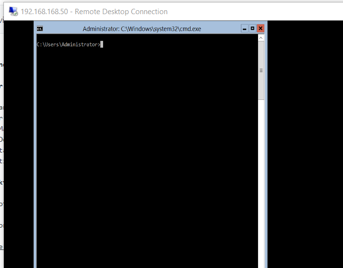
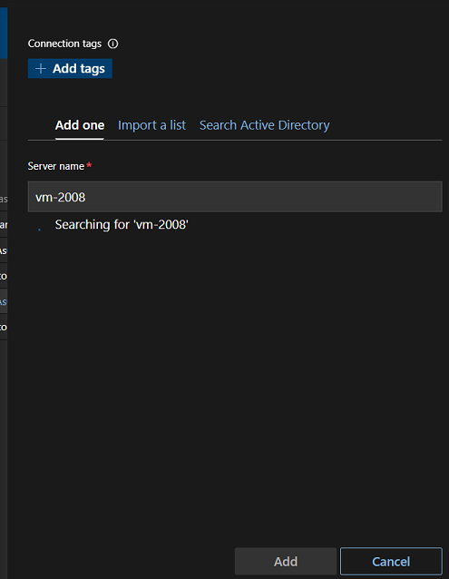
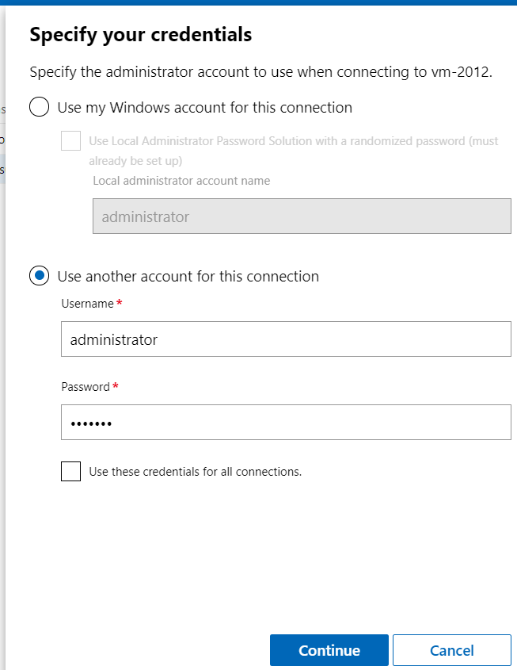
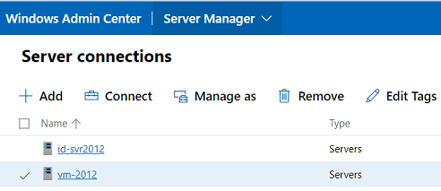
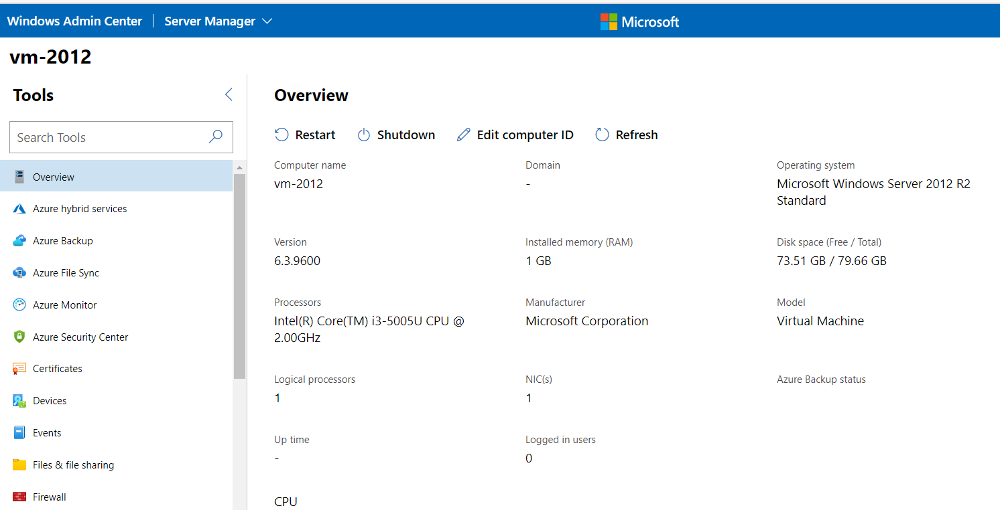

I have some problems when it comes to manage Windows Server Core / without GUI.

This is my step by step on how to install [Windows Admin Center](https://www.microsoft.com/en-us/windows-server/windows-admin-center) to manage my servers

I am using Windows 2012 Core Server as an example

| **Before you start** |  |
|---|---|
| 1. | [Windows 2012 Core Survival Guide](https://docs.microsoft.com/en-us/archive/blogs/bruce_adamczak/windows-2012-core-survival-guide-remote-desktop) |
| 2. | [Windows Admin Center](https://www.microsoft.com/en-us/evalcenter/evaluate-windows-admin-center) |
| 3. | [Windows 2012 Environment Preparation](https://docs.microsoft.com/en-us/windows-server/manage/windows-admin-center/deploy/prepare-environment#prepare-windows-server-2012-and-2012-r2) |
| 4. | [Install and Configure WMF 5.1](https://docs.microsoft.com/en-us/powershell/scripting/windows-powershell/wmf/setup/install-configure?view=powershell-7.1) |

## Install Windows Server 2012 Core as usual

You don't need my help to do this ... :)

## Change your server's environment

Using `sconfig`, change some parameter here:
1. Change computer name
2. Enable Remote Management
3. Enable Remote Desktop with any client version
4. Change IP to static
5. Change date / time


## Remote Desktop your new server :

Before we can remote desktop to our server, we need to Enable Firewall for remote desktop:

```sh
PS C:\Users\Administrator> Enable-NetFirewallRule -DisplayGroup "Remote Desktop"
```

Now we can manage our server using remote desktop




> Firewall is something we don't talk here. My environment is local LAN with no access to the internet

## Install Windows Admin Center to your Windows 10 Laptop:
- **Download it here**: (https://www.microsoft.com/en-us/evalcenter/evaluate-windows-admin-center)
	
- **Manage it Here** : (https://docs.microsoft.com/en-us/windows-server/manage/windows-admin-center/deploy/install)
	
- **If you having problem with TrustedHosts** : (https://docs.microsoft.com/en-us/windows-server/manage/windows-admin-center/support/troubleshooting#configure-trustedhosts)

## Add new server to your Windows Admin

### On our laptop, Add server's `hostname` to our laptop `hosts` file

```
192.168.0.50 vm-server2012
```

### On the server, change some parameter:

- **Enable WinRM** :

```sh
PS C:\Users\Administrator> Enable-PSRemoting -Force
```

- **Enable File and Printer Sharing** :

```sh
PS C:\Users\Administrator> Enable-NetFirewallRule -DisplayGroup "File and Printer Sharing"
```

- **Install WMF version 5.1 or higher** :
	- Download here : (https://go.microsoft.com/fwlink/?linkid=839516)
	- Copy your downloaded file to your server
	- Install it via remote desktop

Now, add your server by their hostname.


If you having problem connecting, it might be credential problem like mine. 

Select your server, then choose "manage as" and fill it with your username / password



# Now, manage your server:

## Server List



## Dashboard



That's it, you may now manage your server anywhere using your browser.

If you have any problems following this article, you may [contact me](../about)
